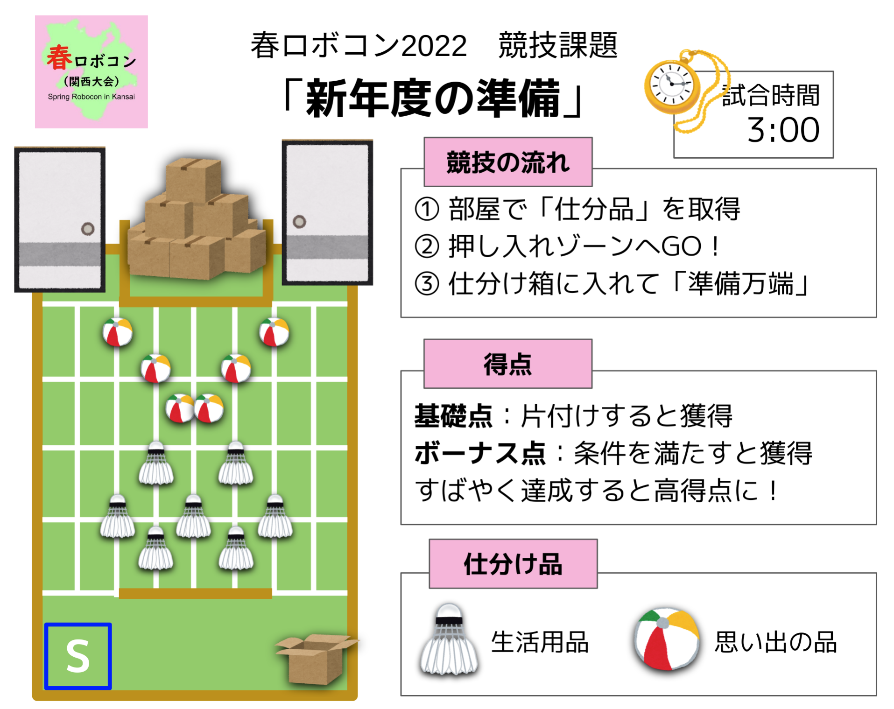

# 関西春ロボゼミ2022

本ページは，[関西春ロボコン運営委員会](https://xn--tck4d2b0a0029dol2bn0r.com)との共催企画「**関西春ロボゼミ2022**」の開催記録です．

## 概要

関西春ロボゼミ2022は，[春ロボコン2022（関西大会）](https://関西春ロボコン.com/)に参加したチームの発表会です．

各チームには，プレゼンテーション形式で発表を行っていただきました．
また，公開イベントとして実施し，一般の方々もご参加いただけるようにいたしました．

関西春ロボゼミ2022は，関西春ロボコン運営委員会およびロボティクス勉強会運営会の共催イベントです．

- 日時：2022/04/02 (土) 16:00~18:00
- ツール：ZOOM
- イベントページ：[connpass](https://robosemi.connpass.com/event/243527/)

## 春ロボコン（関西大会）について

春ロボコン（通称：春ロボ）とは，NHKロボコン大会を目指す大学・高等専門学校の新人チームによるロボット競技会です．

NHKロボコン大会に近い環境で経験を積むことにより，技術のみならずチーム運営面での課題の発見・解決を経験すると共に，学校間の交流から様々な刺激や学びを得る場でもあります．この競技会を経てNHKロボコン大会でより活躍できるよう準備してもらうことを目指しています．

春ロボコン2022 （関西大会）は，2022年3月10-11日に，京都府南丹市あかまつの丘 西本梅 体育館にて開催されました．

- 公式ホームページ：[関西春ロボコン.com](https://関西春ロボコン.com/)
- 公式Twitter：[@kansai_robocon](https://twitter.com/kansai_robocon)
- 公式Facebook：[@kansai.robocon](https://www.facebook.com/kansai.robocon)

## 開催趣旨

関西春ロボゼミ2022は，以下の3点を主たる目的として開催されました．

1. **技術継承の促進**：発表資料の作成を通じて，参加チームに当シーズンの開発成果をまとめていただくきっかけにしていただければと考えております．
2. **成果物以外への注目**：大会会場で機体を囲んで行われる交流会では，ボツとなった案や試作機の話を細かくすることが簡単ではありません．また，マネジメントについての交流は，資料がないとその実態が掴みづらいと言えます．本企画では，そのような部分の発表を積極的に歓迎し，開発の深層まで踏み込んだ技術交流を図ります．
3. **多様なフィードバックの機会の提供**：公開イベントとして実施することで，他大のOB/OGや一般のエンジニアなど，様々な視点を持った方々からのフィードバックを得る機会を提供します．

## プログラム

| 時間 | 内容 | 資料等 |
| :---: | :---: | :---: | 
| 16:00-16:10 | オープニング | - |
| 16:10-16:35 | 発表：大阪大学 Robohan |  | 
| 16:35-17:00 | 発表：三重大学 M³RC |  | 
| 17:00-17:25 | 発表：京都工芸繊維大学 モタモーター |  | 
| 17:25-17:50 | 発表：京都工芸繊維大学 単位回収bot |  | 
| 17:50-18:00 | クロージング | - |
| 18:00- | フリータイム | - |

## 講評と結果

関西春ロボコン運営委員会とロボティクス勉強会運営会の協力の下で，講評および審査を行い，**最優秀発表賞を三重大学「M³RC」に贈呈**しました．

<iframe src="./files/harurobosemi2022_comment.pdf" width="100%" height="100%"></iframe>

