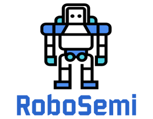

<link rel="shortcut icon" type="image/x-icon" href="/favicon.ico?">

# ロボティクス勉強会（ロボゼミ）

## 概要
ロボゼミとは，LT以上，学会発表未満くらいの濃度でのロボティクスに関係する勉強会です．

勉強会とありますが，情報交換にもまた主眼を置いているので，軽目の発表も大歓迎です！

- アカデミックな理論や自身の研究の紹介
- 「このロボットが面白い！」
- 「こんなもの作ってみた」

などなど，ロボティクスに関連するあらゆるテーマの発表を歓迎します．

## スケジュール
毎月，第3週の金曜日を基本としています．

イベントの告知は**[connpassのページ](https://robosemi.connpass.com/)**にて行われます．

イベントの約4週間前に開催が告知され，発表者を先行して募集します．
その後，イベントの約2週間前になると聴講者の募集も開始されます．

## 開催記録
ロボゼミは2020年5月に試験開催を行い，2020年6月から定期開催を始めました．
以下のリンクでは，年毎に，発表者と発表タイトルを記録しています．

- [2020](archive/history2020)

## 主催
- 安達 波平　（筑波大学）
- 大西 祐輝　（東京工業大学）
- 吉本 幸太郎（奈良先端科学技術大学院大学）

## 後援
本企画は第1回より，[日本ロボット学会](https://www.rsj.or.jp/)の[ヒューロビント研究専門委員会](http://www.koj-m.sakura.ne.jp/hurobint/)からご後援をいただいております．
ロボティクス分野の若手研究者・技術者交流促進の場としての可能性を，共に探って参ります．

- - -
<a class="twitter-timeline" data-width="540" data-height="720" data-theme="light" href="https://twitter.com/robosemi?ref_src=twsrc%5Etfw">
  Tweets by robosemi
</a>
 

Our logo has been created on Online Logo Maker.
Look at the awesome logo I made at [Online Logo Maker](https://onlinelogomaker.com/)
